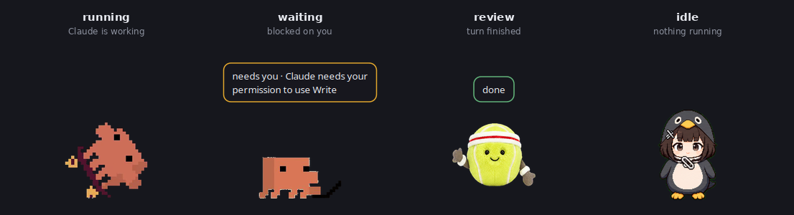

# claude-pet

[](https://github.com/HaneulOscarLee/claude-pet/actions/workflows/ci.yml)

**A desktop pet for [Claude Code](https://claude.com/claude-code), on Linux.**

An always-on-top sprite sits on your desktop and reacts to what Claude Code is
actually doing — working, blocked on you, finished, or failed — so you can tell
at a glance without switching to the terminal.

It renders **sprite packs from [codex-pets.net](https://codex-pets.net/)**, so
all ~3000 community packs made for the Codex desktop app work here unchanged.



## Why this exists

OpenAI shipped pets for the **Codex** desktop app, on **macOS and Windows
only**. There is no Linux build, and nothing equivalent for Claude Code.

claude-pet is the same idea pointed at a different agent and a different OS:

|  | Codex pets | claude-pet |
|---|---|---|
| Agent | Codex | **Claude Code** |
| Platform | macOS, Windows | **Linux** (X11 / Wayland via XWayland) |
| Sprite packs | codex-pets.net | **the same packs, unchanged** |

Built and tested on **Ubuntu 24.04** (GNOME 46, Wayland session). Nothing in it
is Ubuntu-specific beyond the dependency names.

## Requirements

- Linux with X11, or a Wayland session with XWayland (GNOME, KDE — both fine)
- Python 3.10+
- PyGObject / GTK 3, and Pillow with WebP support

The installer below handles all of this for you on apt, dnf, pacman and zypper
systems. To do it by hand on Ubuntu or Debian:

```bash
sudo apt install python3-gi python3-gi-cairo gir1.2-gtk-3.0 python3-pil \
                 wmctrl libnotify-bin
```

The last two are optional: `wmctrl` lets clicking the pet raise a terminal that
is not running tmux, and `libnotify-bin` enables desktop notifications, which
are off by default anyway.

> **Why XWayland?** `_NET_WM_STATE_ABOVE` is the only always-on-top mechanism
> mutter honours for an ordinary client, and `gtk-layer-shell` is wlroots-only.
> So the launcher exports `GDK_BACKEND=x11` and the window goes through
> XWayland even in a Wayland session. You do not have to configure anything.

## Install

### Without a terminal (Debian / Ubuntu)

Download the `.deb` from
[Releases](https://github.com/HaneulOscarLee/claude-pet/releases/latest) and
open it. GNOME Software installs it and pulls in GTK, Pillow and `wmctrl` for
you.

Then launch **claude-pet** once from your applications menu. That finishes the
user side of the setup — a sprite pack, the Claude Code hooks in your own
`~/.claude/settings.json`, tab completion — and starts the pet. Nothing to type.

After that, everything day-to-day is in the pet's right-click menu: install and
remove pets, check for updates, toggle behaviour. Updates for a packaged install
come from Releases, and the menu's update entry opens that page.

### One line, any distro

```bash
curl -fsSL https://raw.githubusercontent.com/HaneulOscarLee/claude-pet/main/install.sh | bash
```

No git needed — it downloads the source tarball from GitHub into
`~/.local/share/claude-pet`, installs everything it needs through your package
manager (GTK, Pillow, `wmctrl`, `libnotify`), and runs `setup`.

To update later:

```bash
claude-pet update           # or --check to just see if there is one
```

It works out which kind of install it is on: a git clone is fast-forwarded, a
tarball install is re-downloaded. Either way the pet is restarted onto the new
code. A clone with uncommitted changes is left alone rather than clobbered. Re-run it any time to upgrade. It refuses to overwrite a target
directory that is not a previous install of its own.

If piping a script into a shell is not your thing — reasonable — read it first
([`install.sh`](install.sh)), or clone and run `setup` yourself:

```bash
git clone https://github.com/HaneulOscarLee/claude-pet.git
cd claude-pet
./claude-pet setup
```

Either way, `setup`:

- symlinks `claude-pet` into `~/.local/bin`, and adds that to `PATH` in your
  shell rc if it is not there already, so `claude-pet` works from any directory
- installs tab completion for bash and zsh, both via the standard completion
  directory and a line in your shell rc, so it works with or without the
  `bash-completion` package
- offers to install `wmctrl`, which is what lets a click raise a terminal that
  is not running tmux (the only step that needs `sudo`; skip it with
  `--no-deps`, and it is skipped automatically when there is no terminal to
  prompt on)
- makes your terminal reachable for those clicks if it is a Wayland-native one
  that cannot be raised — see [jumping back to a session](#jumping-back-to-a-session);
  `--no-deps` skips this too, and `claude-pet fix-terminal --undo` reverts it
- downloads the default sprite pack, falling back to the bundled one offline
- wires the hooks into `~/.claude/settings.json`
- starts the pet

Run `exec $SHELL` afterwards so the PATH and completion changes take effect.
It is idempotent — run it again and it tells you there is nothing to do.
`claude-pet doctor --fix` is the same thing.

A pet pack ships with the repo (`assets/pets/pocket`), so a clone has something
to show without a download. Anything you install yourself takes priority over
it.

Then start a new Claude Code session. That is it — the pet follows along.

Nothing gets built and no virtualenv is created; it runs from wherever it was
installed, so keep that directory where it is — or re-run `setup` after moving
it, since the hooks record an absolute path.

Installer knobs: `CLAUDE_PET_DIR` to install elsewhere, `CLAUDE_PET_REF` for a
branch or tag, `CLAUDE_PET_NO_DEPS=1` to skip the system packages.

### Checking on it

```bash
claude-pet doctor
```

`doctor` distinguishes three things: `FAIL` is genuinely broken, `TODO` is a
setup step not taken yet, and `--` is an optional extra you can live without.
Only `FAIL` is a problem, and only `FAIL` makes it exit non-zero.

### Picking a different pack

```bash
claude-pet search                # browse the gallery
claude-pet add doro-v2-roshan    # install another
claude-pet use doro-v2-roshan
claude-pet restart
```

After `install-hooks` you never start or stop the pet by hand:

- **starts with Claude** — the `SessionStart` hook launches the overlay
  detached, so it survives the terminal that started it
- **quits with Claude** — once every session has ended, the pet waits out a
  30 second grace period (in case you are just reopening a terminal) and exits.
  `SessionEnd` is the clean signal, but it never arrives when Claude is killed
  outright — a terminal closed with its window button, a crash, a reboot — so
  each session's Claude pid is recorded and checked directly. A session whose
  process is gone stops counting immediately, whether or not it said goodbye.

Both are on by default and can be toggled from the pet's right-click menu, or
with `claude-pet set autostart false` / `set exit_when_no_sessions false`.
`exit_grace_seconds` sets the wait.

If you do start it yourself, `claude-pet run --detach` backgrounds it so
closing the terminal does not take the pet with it. Plain `claude-pet run`
stays in the foreground, which is what you want for debugging.

## More than one agent

The pet follows **Claude Code**, **Codex** and **Gemini CLI** at once, in one
pet. They turn out to share a hook vocabulary: Codex's binary carries Claude's
event names verbatim, and Gemini ships a `hooks migrate` whose entire job is
rewriting a Claude configuration into its own. So one bridge serves all three.

```bash
claude-pet install-hooks              # wires up every agent it finds
claude-pet install-hooks --agent gemini
```

```console
$ claude-pet install-hooks
  Claude Code  /home/you/.claude/settings.json  added 8 event(s)
  Codex        /home/you/.codex/config.toml     added 8 event(s)
               approve them once in Codex with /hooks
  Gemini CLI   /home/you/.gemini/settings.json  added 7 event(s)
```

**Codex asks you to approve hooks once.** Anything that can run a command on
its behalf starts out untrusted, whoever wrote it, and it is Codex's business
to ask rather than claude-pet's to answer — so the hooks are installed and
approving them is left to you, in Codex's own `/hooks` view. Its settings are
TOML, so they go in between markers rather than being re-serialised: your
comments, key order and formatting are yours, and `uninstall-hooks` takes the
block back out byte for byte.

What differs between them is narrow, and handled:

| | Claude Code | Gemini CLI | Codex |
|---|---|---|---|
| turn starts | `UserPromptSubmit` | `BeforeAgent` | `UserPromptSubmit` |
| turn ends | `Stop` | `AfterAgent` | `Stop` |
| tool calls | `Pre`/`PostToolUse` | `Before`/`AfterTool` | `Pre`/`PostToolUse` |
| settings | `~/.claude/settings.json` | `~/.gemini/settings.json` | `~/.codex/config.toml` |
| its process | `claude` | `node` | `codex` |

That last row matters more than it looks. A session stays tracked by checking
its process is still alive, and Gemini's process is called `node` — so its
command line is checked too, or every Node program on the machine would pass
for a Gemini session and keep dead entries alive forever.

Sessions from other agents are labelled in `claude-pet status`:

```console
  ed0f2f9c        running        Bash                pid=3050615  PreToolUse 0s ago
  7c31a0b4        running        [gemini] ReadFile   pid=3862004  PreToolUse 2s ago
```

Not every agent has every event. Codex has no `Notification` and no
`SessionEnd` — so a Codex session ending is noticed by its process going
away, which is how a session that dies without saying so is handled anyway.
Gemini has no `SubagentStop`. Nothing is offered to an agent that would
reject it: the list each one supports was checked against what it actually
registered, not assumed. `claude-pet doctor` says where each agent stands.

**OpenCode is not supported**, having been looked at and left out. Its
extension point is a JavaScript plugin exporting callbacks rather than a
command a hook can run, and its event bus carries message traffic without
anything that plainly marks a turn starting or ending — so `working` and
`done` would have to be inferred, and a pet built on inference is a pet
that sits on the wrong state. It needs a real turn boundary first.

## What the pet shows

| Claude Code hook | State | Bubble reads |
|---|---|---|
| `SessionStart` | `waving` | session started |
| `UserPromptSubmit` | `running` | working |
| `PreToolUse` / `PostToolUse` | `running` | working · *tool name* |
| `PostToolUse` reporting an error | `failed` | failed |
| `Notification`, blocked | `waiting` | needs you · *Claude's own message* |
| `Notification`, only "you haven't typed" | — | ignored, see below |
| `Stop` | `review` | done |
| `SubagentStop` | `running` | working · subagent finished |
| `SessionEnd` | — | the session is forgotten |

All nine animation rows get used, because states have a lifecycle rather than
just switching:

```
SessionStart ──> waving ──────────────────> idle ──> wanders (running-left/right)
UserPromptSubmit ──> running
Stop ──> jumping (once) ──> review ──20s──> idle ──> wanders
tool error ──> failed ──────────────20s──> idle
Notification ──> waiting  (holds until Claude moves on — never times out)
```

Finishing a turn earns a hop, then the pet shows `done` for 20 seconds, then
settles and starts wandering. Without that dwell `review` would stick until
your next prompt, and the idle and walking rows would never be seen.

A dwell belongs to **the session that reported it**, not to the pet. When one
session finishes while others are still working, that session says `done` for
its 20 seconds and then hands the pet back — it does not drag everything to
idle while real work is going on.

**needs you** is reserved for Claude actually being blocked. Claude Code sends
its `Notification` hook for two unrelated situations: it wants permission and
cannot go on, or a turn ended and you have not typed since. Only the first is
worth a pet asking for you — the second arrives about a minute after the pet
has already said **done**, and since `waiting` never times out it left the pet
demanding attention for the sole offence of you reading its output. So a
notification arriving after `Stop` is ignored. The same wording *during* a turn
still counts, because then it means Claude has asked you something and is
waiting on the answer.

`running` gets a second opinion, because it is the one state that can be left
behind: **a turn you interrupt sends no `Stop`**, and the pet would otherwise
sit on **working** until a five-minute backstop expired with nothing running.
So the pet also watches whether the session's process is doing anything —
Claude Code animates a spinner while it works, so a working session burns
measurable CPU (~0.17s per second here) and one sitting at its prompt does not
(~0.005s). After 45 seconds of a stale `running` on a process that has done
nothing, the pet gives up on it and goes idle.

Only `running` is second-guessed. `waiting` is a claim about *you*, not about
the process, and an idle Claude is exactly what being blocked on you looks
like. If the answer cannot be observed — no reading yet, process gone — nothing
is concluded and the backstop applies as before.

`claude-pet status` shows what each session reported, what it still counts for,
and which hook event put it there, which is where to start when the pet is
showing something you do not expect:

```console
$ claude-pet status
sessions  :
  ed0f2f9c        running        Bash        pid=3050615  PreToolUse 0s ago
  40660d1a        waving→idle                pid=3072258  SessionStart 11816s ago
```

A state you did not expect is usually over by the time you go looking, so the
pet also keeps a short log of every change and what caused it:

```console
$ claude-pet log
12:18:04  idle -> running  via=PreToolUse         session=ed0f2f9c  sessions=4  detail='Bash'
12:18:07  running -> review  via=DesktopNotification  session=claude-desktop  sessions=4
```

Several Claude sessions at once collapse into the most urgent state:

```
waiting  >  failed  >  review  >  running  >  waving  >  idle
```

So a pet reading **needs you** means *some* session wants your attention, the
bubble names which message, and the bubble shows `(N sessions)` when more than
one is live. One pet covers every session — it does not matter how many
terminals or projects you have open:

| Live sessions | Pet shows |
|---|---|
| A `running`, B `review`, C `waiting` | **needs you** · *C's message* · `(3 sessions)` |
| A `running`, B just finished | **done** `(2 sessions)` for 20s, then **working** |
| A `running` | **working** · *tool name* |
| all idle at their prompts | **idle**, and it starts wandering |
| none | **idle** |

Sessions are tracked by Claude's own session id and dropped on `SessionEnd` —
or, when a session dies without one (a terminal closed with its window button,
a crash, a reboot), as soon as the pet notices its process is gone.

**Going quiet is not the same as going away.** A session left at its prompt
overnight is idle, not dead, and stays tracked for as long as its Claude
process is alive — days, if you leave it. Only entries too old to carry a
process id fall back to a six-hour timeout.

The pet starts on `SessionStart` and on `UserPromptSubmit`, so if it is not
running — you quit it, or it exited while every session was closed — carrying
on with a conversation you already had brings it back. It used to take an
entirely new session.

Bubble labels ship in English and Korean: `claude-pet set language ko`
(`auto`, the default, follows your locale).

Desktop notifications are **off** by default — the bubble is the channel, and
a notification on top of it is the same news twice. Turn them on with
`claude-pet set notifications true` or from the right-click menu.

### The Claude Desktop app

The pet follows the [Claude Desktop](https://claude.ai/download) app too, and
how well depends on which half of it you are using.

| In Claude Desktop | Pet shows | How |
|---|---|---|
| a **Claude Code** session | every state, exactly as in a terminal | the app runs the real Claude Code binary, which fires the same hooks |
| a **plain chat** | **done** / **needs you** when a reply lands | the app's desktop notification, the only turn signal it emits |
| app open, nothing happening | `idle`, and the pet stays up | — |

**Claude Code inside the app needs no setup.** Claude Desktop downloads and runs
the ordinary Claude Code binary, and it reads the same `~/.claude/settings.json`
your terminal sessions do — so once the hooks are installed, sessions started in
the app drive the pet identically. Clicking the pet brings the app forward
rather than hunting for a terminal that does not exist.

**A plain chat is coarser, and honestly so.** There is no hook surface on that
side. The one signal the app emits is the desktop notification it posts when a
reply arrives, so that is what the pet watches — which means:

- you get **done**, held 20 seconds. Never **needs you**: the text of a
  notification is not evidence of what it wants, and reading it for words like
  "permission" turned ordinary Korean notices — `확인`, the label on half the
  OK buttons — into a pet demanding attention nobody had asked for. Where
  **needs you** genuinely applies, that work runs through Claude Code and says
  so through the hooks
- you do **not** get **working**, because nothing announces the start of a turn
- both time out on their own, unlike the same states from a terminal session.
  A session *reports* a state and keeps reporting it, so its **needs you** is
  allowed to hold until Claude moves on. A notification is a one-off: nothing
  will ever say the reply was read, so a state derived from one that did not
  expire would simply stick
- notifications only fire while the app's window is **unfocused**, which is
  exactly when a pet is worth glancing at, and never when you are already
  looking at the reply
- if you have turned notifications off in Claude Desktop, there is nothing left
  to watch and plain chats will not register

Watching them needs a D-Bus *monitor* connection, because `Notify` is a method
call to the notification daemon rather than a broadcast. Notifications from
other applications are ignored, and so are the pet's own.

While the app is open it counts as a live session, so the pet does not decide
everything has gone and quit. Turn the whole thing off with
`claude-pet set desktop false`, or **Follow Claude Desktop** in the right-click
menu — the pet then goes back to tracking terminal sessions only.
`claude-pet doctor` reports what it can see.

## Usage

```
claude-pet <command> [options]
```

### Pets

```bash
claude-pet search                       # most popular packs
claude-pet search penguin --limit 5     # search by text
claude-pet search --version 2           # only v2 packs (these have mouse-look)
claude-pet search --sort new

claude-pet add clawd                    # install one
claude-pet add clawd tennis-ball dario  # or several
claude-pet add-collection cats          # a whole curated collection
claude-pet add guga --codex-home        # install into ~/.codex/pets instead

claude-pet hatch ~/Pictures/cat.png     # build a pack from any image

claude-pet remove dario                 # delete a pack (-y to skip the prompt)
claude-pet remove dario guga -y         # or several

claude-pet list                          # what is installed
claude-pet use tennis-ball               # pick the active pack
claude-pet preview tennis-ball           # dump all animation rows to a PNG
claude-pet demo                          # watch every row in the live window
```

Found a pack you like on the gallery? The pet id is the last path segment of
its URL, so `https://codex-pets.net/#/pets/doro-v2-roshan` becomes:

```bash
claude-pet add doro-v2-roshan
claude-pet use doro-v2-roshan
claude-pet restart
```

```console
$ claude-pet list
* clawd                    v1 · 192x208 · 57 frames · 0 looks
    /home/you/.claude/pets/clawd
  tennis-ball              v2 · 192x208 · 58 frames · 16 looks
    /home/you/.claude/pets/tennis-ball
```

### Overlay

```bash
claude-pet run                  # start it in the foreground
claude-pet run --detach         # ...or in the background, outliving the terminal
claude-pet run --pet dario      # start with a specific pack, just this once
claude-pet restart              # after changing the pack or settings
claude-pet stop
claude-pet status               # current state and every live session
claude-pet log                  # what it showed over time, and why
claude-pet reset-position       # send it back to its corner if you cannot find it
```

```console
$ claude-pet status
overlay   : running (pid 3877683)
state     : running  (1 sessions)
detail    : Bash
active pet: clawd
state file: /home/you/.local/state/claude-pet/state.json
sessions  :
  ed0f2f9c        running  Bash                pid=3050615
  claude-desktop  review                       pid=14067
```

### Integration

```bash
claude-pet setup                      # pack + hooks + PATH link + start
claude-pet update                     # fetch the new version, then restart the pet
claude-pet update --check             # is there a newer version?
claude-pet doctor                     # environment + integration check
claude-pet doctor --fix               # same as setup

claude-pet install-hooks              # ~/.claude/settings.json (global)
claude-pet install-hooks --project    # ./.claude/settings.json (this repo only)
claude-pet uninstall-hooks

claude-pet fix-terminal               # run the terminal under XWayland
claude-pet fix-terminal --undo        # put it back
```

`install-hooks` **merges** into your existing settings: it never touches hooks
it did not write, and re-running it adds nothing. `uninstall-hooks` removes
only its own entries.

`update` works out which kind of install it is looking at and does the right
thing for it:

| Install | What `update` does |
|---|---|
| git clone | fast-forwards `main` (refuses if you have uncommitted changes) |
| `install.sh` tarball | re-downloads and replaces the tracked files |
| `.deb` | downloads the new package and hands it to the system installer, which asks for authority through the desktop's usual prompt |

The last one cannot rewrite `/usr` itself — dpkg has to do that — but a command
called `update` that only prints a link has not updated anything, which is
exactly how it was reported.

Whichever route, the running pet restarts onto the new code. It also notices
when its files are replaced underneath it and restarts by itself, so upgrading
the package through apt or a software centre applies without the pet carrying
on with the old behaviour. And since an update replaces code and not packages,
it names anything the new version could use and cannot find:

```console
$ claude-pet update
updated : 0.1.0 -> 0.2.0

this version can do more with a package you do not have:
  status-bar menu: sudo apt install gir1.2-ayatanaappindicator3-0.1
```

### Settings

```bash
claude-pet set height 160             # sprite height in pixels
claude-pet set anchor bottom-left     # bottom-right | bottom-left | top-right | top-left
claude-pet set walk false             # stop wandering (also in the right-click menu)
claude-pet set walk_speed 6           # or let it hurry
claude-pet set language ko
claude-pet set bubble alerts          # only speak up when it needs you
claude-pet set position none          # forget a dragged position, re-anchor
```

| Key | Default | Meaning |
|---|---|---|
| `pet` | first found | active pack id |
| `height` | `132` | on-screen sprite height in pixels |
| `anchor` | `bottom-right` | corner to start in |
| `walk` | `true` | wander along the screen edge while idle |
| `walk_speed` | `3` | pixels per step while wandering; raise it for a sprint |
| `language` | `auto` | bubble labels: `auto` \| `en` \| `ko` |
| `bubble` | `active` | when to speak: `active` (any non-idle state) \| `alerts` (only needs-you / done / failed) \| `never` |
| `notifications` | `false` | also send a desktop notification |
| `look_at_mouse` | `true` | v2 packs: face the pointer while idle |
| `autostart` | `true` | let the `SessionStart` hook launch the overlay |
| `update_check` | `true` | look for a newer version in the background |
| `desktop` | `true` | follow the Claude Desktop app as well as terminal sessions |
| `exit_when_no_sessions` | `true` | quit once every Claude session has ended |
| `exit_grace_seconds` | `30` | how long to wait first, in case one reopens |
| `position` | `null` | remembered drag position |

Stored in `~/.config/claude-pet/config.json`.

### Debugging

```bash
claude-pet demo                                      # cycle every animation row
claude-pet demo --pet doro-v2-roshan --seconds 1     # check a specific pack, faster
claude-pet snapshot out.png                          # capture the live overlay
claude-pet snapshot out.png --state waiting \
    --detail "needs permission"                      # capture a forced state
```

Useful because GNOME blocks its screenshot D-Bus API for unauthorised callers,
so this is how you get a picture of the window.

## Interaction

| Action | Result |
|---|---|
| click | **jump to that session** (see below), or pin the bubble if there is nowhere to jump |
| drag | move the pet — mid-stride is fine; it stops the moment you grab it |
| right-click | everything below, without a terminal |

Drag it anywhere on any screen, right up to the top edge: the pet keeps the
bubble above itself normally and puts it underneath when there is no room, so
what stops at the edge of the screen is the pet rather than the invisible box
it is drawn in. It stays on whichever monitor you drop it on.

The right-click menu covers day-to-day use on its own: switch pack, browse the
gallery, install a pet (paste its id or just its gallery link), remove the
current one, change language, toggle wandering / notifications / follow-Claude-
Desktop / start-with-Claude / quit-when-no-sessions, reset position, check for
and apply updates, and quit. The version is
checked in the background 20 seconds after start and every six hours after that
— `claude-pet set update_check false` turns that off.

Clicks land only on the sprite itself — the rest of the window is
click-through, so the pet never steals a click meant for what is underneath.
A drag only begins once the pointer has actually travelled a few pixels, so a
plain click stays a click, and the pet keeps walking until you actually press
it rather than freezing whenever the pointer passes over.

The right-click menu is an ordinary window rather than a `GtkMenu`, which is
what makes it close when you click anywhere else — including on a
Wayland-native window. A `GtkMenu` holds a keyboard grab, and that grab is
precisely the problem: focus cannot move while it is held, so no focus-out ever
arrives, and a click landing on a Wayland surface never reaches an XWayland grab
either. An ordinary focusable window is managed by the compositor and gets
focus-out from any click, on either kind of surface.

### The menu

Right-click the pet. It opens on a short page rather than one long list —
with a dozen packs installed the packs *were* the menu, and the settings sat
off the bottom of the thing you opened to reach them.

```
clawd · v2
──────────────
Pets…                 →  pick one · browse the gallery · install · remove
Language…             →  automatic · English · 한국어
──────────────
Wander around              ✓
Desktop notifications
Follow Claude Desktop      ✓
Start with Claude          ✓
Quit when no sessions      ✓
──────────────
Reset position
Up to date
Quit
```

Language takes effect immediately — the pet keeps its place and its state,
since only its vocabulary changed. Picking a different pack restarts it,
because the sprites have to be reloaded.

### When you cannot find the pet

Everything above goes *through* the pet, which is no help when the pet is
somewhere you cannot click — dragged onto a second screen that has since been
unplugged, or buried under something full-screen. So the same controls also
live in the status bar, where they cannot wander off, with **reset position**
at the top.

That needs `gir1.2-ayatanaappindicator3-0.1` (installed by `install.sh` and
recommended by the `.deb`) and, on GNOME, an extension that shows tray icons —
Ubuntu ships one enabled. `claude-pet doctor` says whether you have it.

Failing all of that, from any shell:

```bash
claude-pet reset-position
```

The pet also checks its remembered position at startup and re-anchors if that
place is no longer on any screen, so a pet lost with the monitor it was on
comes back by itself next time it starts.

### Jumping back to a session

When the pet is showing **needs you**, **done** or **failed**, the bubble adds
`↩ click to jump` and clicking takes you to the session behind it.

| Setup | What happens |
|---|---|
| session started in **Claude Desktop** | brings the app forward |
| Claude running inside **tmux** | raises the terminal *and* switches to the exact pane |
| **X11 or XWayland** terminal, with `wmctrl` or `xdotool` | raises the terminal window (`setup` installs `wmctrl`) |
| **Wayland-native** terminal that implements `org.freedesktop.Application` | asks the terminal to present itself |
| any other **Wayland-native** terminal | not possible — the pet says so rather than pretending |

`claude-pet doctor` reports which methods are available on your machine.

#### Why the last row cannot be fixed

Under mutter a client may not raise *another* application's window.
`org.gnome.Shell.FocusApp`, `.Introspect` and `.Eval` all answer `AccessDenied`,
and xdg-activation needs a token only the target application can hand out. An
application raising *itself* is always allowed, which is what the D-Bus route
uses — but the terminal has to expose a method for it, and not all do.
Terminator, for instance, only offers `unhide_cmdline`, which skips windows that
are already visible, so it reports success while nothing moves.

`setup` handles this for you when it applies: it makes your terminal run under
XWayland, which puts it back within `wmctrl`'s reach. You can also do it, or
undo it, by hand:

```bash
claude-pet fix-terminal          # wrap the terminal
claude-pet fix-terminal --undo   # put it back
```

It writes two things, both under your home directory and both removed by
`--undo`:

- `~/.local/bin/x-terminal-emulator`, a wrapper that execs the real terminal
  with `GDK_BACKEND=x11`. This is what covers **Ctrl+Alt+T**, which runs
  `x-terminal-emulator` off `PATH` and ignores desktop files entirely — and both
  `gnome-shell` and `gsd-media-keys` carry `~/.local/bin` at the front of their
  `PATH`, so the wrapper wins.
- a copy of the terminal's `.desktop` file with `GDK_BACKEND=x11` prefixed onto
  its `Exec` lines, which covers the launcher and the dock.

It is skipped when it would not help: on an X11 session, without `wmctrl`, or
when the terminal already answers `org.freedesktop.Application` and can raise
itself — forcing that one onto XWayland would cost it crisp scaling for nothing.

The alternative, which changes nothing about your terminal, is to run Claude
inside tmux — the pet then jumps to the exact pane:

```bash
tmux new -s work
claude
```

tmux is the only way to land on a *particular* place inside a terminal. Tabs
and splits are widgets inside the application, not windows, so nothing outside
can address them: Terminator's D-Bus interface will happily list its terminals
and tell you which one has focus, but offers no way to select one, and its
direct tab-switching shortcuts are unbound by default.

Raising the window and selecting the pane are separate jobs, and a tmux session
inside a terminal gets both. Finding that window takes a detour: inside tmux the
session's own ancestry reads `bash → tmux: server → systemd`, and the server is
detached from every terminal and owns no window at all. The terminal is the
parent of the tmux *client*, which is asked for at the moment you click, since
you may have detached and reattached somewhere else since.

One case stays imprecise. A terminal that serves several windows from a single
process — Terminator does — gives all of them the same `_NET_WM_PID`, and
nothing distinguishes them from outside. With one window open you land exactly
right; with several, the pane is still exact but the window raised may be a
sibling.

XWayland caveat: on a HiDPI screen an XWayland window can look slightly softer
than a native one. If that bothers you, `--undo` and use tmux instead.

## Sprite packs

Any pack from [codex-pets.net](https://codex-pets.net/) works, in either atlas
format. Packs you already installed with `npx codex-pets add` are picked up
from `~/.codex/pets/` directly, without being copied.

Search order: `~/.claude/pets/`, then `~/.codex/pets/`
(`$CLAUDE_CONFIG_DIR` and `$CODEX_HOME` are respected).

### The format

|  | v1 | v2 |
|---|---|---|
| atlas | 1536 × 1872 | 1536 × 2288 |
| grid | 8 columns × 9 rows | 8 columns × 11 rows |
| cell | 192 × 208 | 192 × 208 |
| `pet.json` | no version field | `"spriteVersionNumber": 2` |

Animation rows, in order:

| Row | Animation | Row | Animation |
|---|---|---|---|
| 0 | `idle` | 5 | `failed` |
| 1 | `running-right` | 6 | `waiting` |
| 2 | `running-left` | 7 | `running` |
| 3 | `waving` | 8 | `review` |
| 4 | `jumping` | 9–10 | 16 look directions (v2 only) |

The v2 look-direction rows are a left-to-right yaw sweep, used to make the pet
face your mouse pointer while idle.

Frame counts per row are **measured from the alpha channel** rather than read
from the published table — real packs sometimes draw a frame past the nominal
count, and trailing cells are required to be fully transparent anyway.

### Animating a picture into a pack

This draws no art. Point it at an image you already have and it derives the nine
rows by transforming that one picture:

```bash
claude-pet hatch ~/Pictures/my-cat.png
claude-pet demo --pet my-cat          # watch every row
claude-pet use my-cat && claude-pet restart
```

A flat background is made transparent automatically. It bobs for idle, leans and
shifts for the running rows, arcs with a squash for jumping, desaturates and
sheds a tear for failure, and draws the `?` and tick that distinguish waiting
from review — all sine-driven transforms of the source image, no drawing model
involved.

That is half of what Codex's `/hatch-pet` does. Codex generates the sprite art
itself with an image model; this only does the packaging. If you want generated
art, generate the image however you like — Codex, any image model, or a friend
who draws — and then point `hatch` at it.

The result will not beat art drawn frame by frame, but it is a real pack: nine
populated rows at the right cell size, loadable by anything that reads the
format.

### Rolling your own

A pack is just a directory:

```
my-pet/
  pet.json
  spritesheet.webp
```

```json
{
  "id": "my-pet",
  "displayName": "My Pet",
  "description": "A pet I drew",
  "spritesheetPath": "spritesheet.webp",
  "spriteVersionNumber": 2,
  "kind": "animal"
}
```

Drop it in `~/.claude/pets/my-pet/` and check it loaded:

```bash
claude-pet list
claude-pet preview my-pet -o check.png    # eyeball every row and frame count
claude-pet demo --pet my-pet              # or watch them animate, row by row
```

`preview` prints the frame count it detected per row, which is the fastest way
to catch a misaligned grid. `demo` is the desktop equivalent of the state
buttons on a gallery page — it steps the real window through every row.

## How it works

```
Claude Code hook ──> claude-pet hook ──> state.json ──> overlay (polls, 250 ms)
```

The hooks and the window share one small JSON file at
`~/.local/state/claude-pet/state.json`, written atomically with a lock that has
a hard timeout. The hook bridge is stdlib-only — no Pillow, no GTK, no network
— and always exits 0, so a broken pet can never break a Claude turn. It costs
about **33 ms** per tool call.

| File | Role |
|---|---|
| `claude_pet/sprites.py` | atlas parsing, v1/v2 detection, frame slicing |
| `claude_pet/hatch.py` | deriving a whole pack from a single image |
| `claude_pet/state.py` | shared state file, multi-session aggregation |
| `claude_pet/hook.py` | hook event → pet state, overlay autostart |
| `claude_pet/overlay.py` | GTK3 window, animation, bubble, walking, mouse-look |
| `claude_pet/launch.py` | starting the overlay detached, shared by hook and CLI |
| `claude_pet/update.py` | updating a git clone or a tarball install in place |
| `claude_pet/locate.py` | recording where a session runs (hook side) |
| `claude_pet/jump.py` | jumping back to it (overlay side) |
| `claude_pet/terminal.py` | making a Wayland terminal reachable for that jump |
| `claude_pet/registry.py` | codex-pets.net API client and installer |
| `claude_pet/config.py` | settings and pack discovery |
| `claude_pet/cli.py` | command line interface |
| `packaging/build-deb.sh` | builds the .deb published on Releases |
| `completions/claude-pet.bash` | tab completion, fed by `claude-pet _complete` |
| `tools/make_default_pack.py` | draws the bundled pack in `assets/pets/pocket` |
| `tests/test_aggregate.py` | multi-session aggregation and dwell behaviour |

```bash
python3 tests/test_aggregate.py    # stdlib only, no test runner needed
```

## Troubleshooting

Start with `claude-pet doctor` — it checks every item below at once.

**No pet appears.** Check `DISPLAY` is set. In a Wayland session the overlay
needs XWayland; `doctor` reports which backend it will use. Look at
`~/.local/state/claude-pet/overlay.log` for a traceback.

**The pet is not on top.** Confirm the window has the right state:

```bash
xprop -name claude-pet _NET_WM_STATE     # expect _NET_WM_STATE_ABOVE
```

Some tiling window managers ignore `_NET_WM_STATE_ABOVE`; there is no
workaround from the client side.

**The pet never changes state.** Hooks are per-settings-file, and a running
session does not pick up newly installed hooks. Run `claude-pet install-hooks`,
then start a *new* session. `claude-pet status` shows whether events are
arriving at all.

**The pet never wanders.** Wandering only happens while `idle`. If any session
is mid-turn the state is `running`, which is correct — wait until every session
is sitting at its prompt.

**The pet is silent.** With `bubble: alerts` it only speaks for needs-you, done
and failed. The default `active` also narrates tool calls.

**The pet does not exit when I close Claude.** Give it `exit_grace_seconds`
(30 by default) — closing a terminal and checking a few seconds later is too
soon. `claude-pet status` shows the auto-exit setting and lists every session
it still counts, marking any whose Claude process has died. If a session lingers
there with a live pid, that Claude really is still running somewhere.

**Tab completion does nothing.** Run `exec $SHELL`, or open a new terminal —
the rc line only takes effect in a shell started after `setup`.

**Clicking does not jump anywhere.** The bubble only offers `↩ click to jump`
when a location was recorded. Sessions that started before `install-hooks` have
none — send one prompt and it is picked up. If the bubble offers it but nothing
happens, `claude-pet doctor` says which methods are usable; on a Wayland-native
terminal none are.

**A pack shows as `broken` in `list`.** The message names the reason. The usual
cause is an atlas that is not 8 columns wide or whose height is not divisible
by 9 or 11.

## Uninstall

```bash
claude-pet stop
claude-pet uninstall-hooks
rm -rf ~/.config/claude-pet ~/.local/state/claude-pet ~/.claude/pets
```

## Contributing

Patches and bug reports are welcome — see [CONTRIBUTING.md](CONTRIBUTING.md),
which covers how the pieces fit and the handful of constraints worth knowing
before changing anything (chiefly: the hook path runs on every tool call and
must stay stdlib-only and fast).

Bug reports should include `claude-pet doctor` and `claude-pet status`. Almost
every problem here has turned out to be environment-specific.

## Credits

The bundled `pocket` pack is original, drawn by `tools/make_default_pack.py`
and covered by this repository's licence. Every other pack is someone else's
work, downloaded on request and never redistributed here.

Sprite packs and the pack format come from the community gallery at
[codex-pets.net](https://codex-pets.net/)
([`portons/codex-pet-share`](https://github.com/portons/codex-pet-share)); the
format is documented in
[`gennadi-kuzmin/awesome-codex-pets`](https://github.com/gennadi-kuzmin/awesome-codex-pets).

Neither this project nor those is affiliated with, endorsed by, or supported by
OpenAI or Anthropic.

## License

[MIT](LICENSE)
